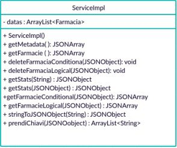

# Farmacie - Progetto creato da Marco Compagnoni e Riccardo Forconi
Repository per progetto del corso di Programmazione a oggetti

# Obbiettivi del programma
1) Andando a prendere il data-set fornito alla consegna dobbiamo collegarci al relativo URL. Il formato in cui troveremo 
i dati all'interno del programma sarà in formato JSON.
2) Andare a scaricare il contenuto del testo all'interno dell'URL in una stringa nel nostro programma.
3) Andiamo a prendere soltanto il campo 1: in resources, in particolare l'URL di quest'ultimo alla quale dobbiamo collegarci per andare a prendere le info relative a tutte le farmacie presenti in Campania. Queste info
saranno presenti in formato JSON e, così come sono, le portiamo all'interno di un file di testo.
4) Andando a riprendere il file con le info andiamo a salvare ogni farmacia in un oggetto che, intuitivamente, 
chiameremo "Farmacia" all'interno del file "Farmacia.java" che descriveremo poi.
5) In farmacia andiamo a impostare i metodi che permettono il cambiamento e il reperimento delle informazioni
relative ad ogni farmacia.
6) Andiamo a costruire un'applicazione (main) che ci permette effettivamente di costruire un vettore di oggetti di
farmacie. Su questo vettore andremo poi a lavorare per implementare tutte le specifiche date nella consegna.
7) Andiamo a simulare un comportamento di un'eventuale applicazione web basata sull'applicazione costruita fino ad ora
utilizzando SpringBoot e Postman.


# Compagnoni-Forconi/project.SpringBootApplication/src/main/java/com/univpm/project/.
all'interno di questo percorso troviamo tutte i file relativi al progetto sviluppato.

### "SpringBootApplication" folder
all'interno di questa cartella troviamo il main attraverso il quale possiamo eseguire il programma. 
L'eseguibile si chiama Application.java e alla cartella viene dato questo nome dato che utilizziamo i servizi SpringBoot 
per utilizzare la nostra applicazione simulando il suo inserimento in un web server.

### "model" folder
All'interno della cartella model possiamo trovare i seguenti file "Farmacia.java" , "metadati.java" e "sourcefields.java". Il file "Farmacia.java" definisce una classe le cui istanze andranno ad immagazzinare tutti i dati associati ad una farmacia. In "metadati.java" è descritta una classe le cui istanze andranno ad immagazzinare i metadati associato ad ogni attributo della classe Farmacia. In "sourcefields.java" è contenuta una classe che si occupera di contenere i nomi di ogni campo della classe Farmacia nella forma utilizzata nel dataset da cui sono stati scaricati. 
### "controller" folder
Nella cartella "controller" sono contenute tutte quelle rotte che l'utente deve utilizzare per interfacciarsi con il Web server  mediante Postman e vengono richimate tutte quelle funzioni che svolgeranno effettivamente la richiesta effettuata.

### "service" folder
Nella cartella sono contenuti "service.java" e "serviceImpl.java". La classe service è un'interfaccia in cui sono dichiarate tutte quelle funzioni richiamate in "controller.java". In "serviceImp.java" invece sono contenute le implementazioni effetive delle funzioni citate in precendenza. 

### "utilities" folder
attraverso questa cartella andiamo a scaricare il testo presente all'interno del data-set fornito alla consegna.
All'interno della cartella sono presenti 3 file:
- Connection: effettua il collegamento URL per riprendere, come detto precedentemente, il testo descritto all'interno del
data-set fornito alla consegna
- Parsing: prende, dal data-set, soltanto la sezione resources che a noi interessa, andando a selezionare specificatamente
i file in formato JSON che dobbiamo poi elaborare all'interno del programma. All'interno del programma possiamo 
andare ad analizzare i commenti relativi ai metodi presenti nel file.
- CreaStruct: inserisce i dati del file da noi creato in uno dei metodi del file Parsing all'interno del vettore di 
"Farmacia" permettondoci quindi di avere la struttura su cui poi possiamo lavorare.

# Il Dataset
Il dataset utilizzato in questo programma è una raccolta di dati riguaradanti l'insieme delle farmacie attive nella regione Campania nell'intervallo temporale che si estende dal 3/06/2019 al 1/08/2019.

# Path Disponibili 
In questa sezione sono illustrate tutti i comandi API utilizzati e le giuste rotte per richiedere le funzionalità del sistema implementate.

**Chiamate GET:**

- **/dati**
Vengono restituiti tutti i dati di ogni farmacia in formato JSON.

- **/metadati**
Vengono restituiti i metadati in formato JSON dei vari attributi che caratterizzano la classe Farmacia.

- **/stats**
Vengono restituite una seguenza di dati statistici in formato JSON di un campo specifico.

- **/statsFiltered**
Vengono restituite una sequenza di dati statistici in formato JSON di un campo specifico calcolate su tutte quelle farmacie che rispettano il filtro fornito in input.

**Chiamate POST:**

- **/dati**
Vengono restituite in fromato JSON tutte quelle farmacie che rispettano il filtro Conditional fornito in input.

- **/dati1**
Vengono restituite in fromato JSON tutte quelle farmacie che rispettano il filtro Logical fornito in input.

**Chiamate DELETE:**

- **/dati**
Procede ad eliminare dalla memoria quella farmacia che ha il codice identificativo uguale a quello passato come parametro.

- **/datiCond**
Procede ad eliminare dalla memoria tutte quelle farmacie che rispettano il filtro conditional fornito in input.

- **/datiLog**
Procede ad eliminare dalla memoria tutte quelle farmacie che rispettano il filtro logical fornito in input.

# Esempi di funzionamento:


Nel sequente paragrafo vengono illustrate il funzionamento delle varie funzionalità e i relativi risultati.

- **1) GET/dati**


La risposta in formato JSON avrà la seguente forma. Ovviamente il numero oggetti Json stampati dipenderà dal numero di farmacie presenti in memoria.
```
{
        "codiceTipologia": "1",
        "indirizzo": "Via Roma, 4/6/8",
        "codcomuneIstat": "64005",
        "descrizioneProv": "AVELLINO",
        "frazione": "-",
        "descrizioneCom": "ARIANO IRPINO",
        "codprovIstat": "64",
        "descrizione": "FARMACIA PADULA SNC DI PASQUALE PADULA E C.",
        "descrizioneTipologia": "Ordinaria",
        "cap": "83031",
        "codId": "11107",
        "partitaIVA": "2459800641",
        "latitudine": "41,16866648",
        "codASL": "0",
        "datafineval": "-",
        "siglaProvincia": "AV",
        "longitudine": "15,11105952"
    }
```
- **2) GET/metadati**


La risposta in formato JSON avrà la seguente forma. 
```
  {
        "sourceField": "CODICE TIPOLOGIA",
        "tipo": "String",
        "aliases": "codiceTipologia"
    },
 ``` 
- **3) GET/stats**


Parametro in ingresso:
```
localhost:8080/stats?campo=cap
```
La risposta in formato JSON avrà la seguente forma:
```
{
    "min": "80010.0",
    "max": "84135.0",
    "sum": "1.41495933E8",
    "media": "81459.94991364422",
    "Deviazione Standard": "1.0"
}
 ```
- **4) GET/statsFiltered**


Body:
```
{"cap":{"$gt": "8000"}}
```
La risposta in formato JSON avrà la seguente forma:
```
{
    "min": "80010.0",
    "max": "84135.0",
    "sum": "1.41495933E8",
    "media": "81459.94991364422",
    "Deviazione Standard": "1.0"
}
```
- **5) POST/dati**


Body:
```
{"cap":{"$gt": "8000"}}
```
La risposta in formato JSON avrà la seguente forma:
```
 {
        "codiceTipologia": "1",
        "indirizzo": "Viale della Rimembranza, s.n.c.",
        "codcomuneIstat": "64020",
        "descrizioneProv": "AVELLINO",
        "frazione": "-",
        "descrizioneCom": "CASALBORE",
        "codprovIstat": "64",
        "descrizione": "IORIO EMILIO",
        "descrizioneTipologia": "Ordinaria",
        "cap": "83034",
        "codId": "11110",
        "partitaIVA": "177860640",
        "latitudine": "41,24274462",
        "codASL": "0",
        "datafineval": "-",
        "siglaProvincia": "AV",
        "longitudine": "15,01483472"
    },
```
- **6) POST/dati1**


Body:
```
{"$or":[{"codId":"11108"},{"descrizioneProv":"AVELLINO"}]}
```   
La risposta in formato JSON avrà la seguente forma:
``` 
{
        "codiceTipologia": "1",
        "indirizzo": "Via Castello, 1",
        "codcomuneIstat": "64005",
        "descrizioneProv": "AVELLINO",
        "frazione": "-",
        "descrizioneCom": "ARIANO IRPINO",
        "codprovIstat": "64",
        "descrizione": "Farmacia Ciccarelli Del Dott. Mario Federico Ciccarelli S.a.s.",
        "descrizioneTipologia": "Ordinaria",
        "cap": "83031",
        "codId": "11116",
        "partitaIVA": "2667910646",
        "latitudine": "41,16866648",
        "codASL": "0",
        "datafineval": "-",
        "siglaProvincia": "AV",
        "longitudine": "15,11105952"
    },
```    
- **7) DELETE/dati** 

Parametro in ingresso:
``` 
localhost:8080/dati?codiceFarmacia=56845
``` 
- **8) DELETE/datiCond**

Body:
```
{"cap":{"$gt": "8000"}}
```
- **9)DELETE/datiLog**

Body:
```
{"$or":[{"codId":"11108"},{"descrizioneProv":"AVELLINO"}]}
```   

# Diagrammi UML

## UseCase Diagram


## Class Diagram


### Package Controller


### Package Model


### Package Service




### Package utilities


# Sequence Diagram
## deleteFarmaciaSimple(String)

## getFarmacie()

## getFarmacieConditional(JSONObject)

## getFarmacieLogical(JSONObject)

## getMetadati()

## getStats(String)
.jpg)
## getStats(JSONObject)


